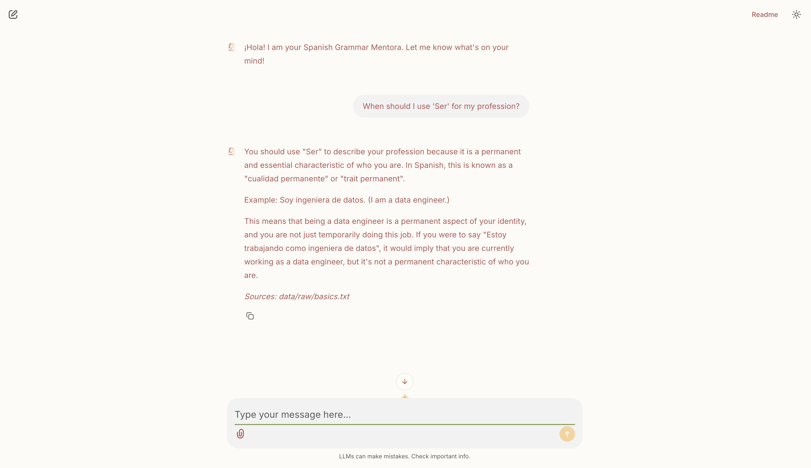

# Mentorati (منطورتي)

<p align="center">

</p>

**Mentorati** is a local, RAG-based (Retrieval-Augmented Generation) Spanish Grammar Tutor. The name is a mix of the word "Moualimati", which means my teacher in the morrocan dialect Darija and the Spanish word "Mentora" which stands for mentor/teacher.

Mentorati leverages local LLMs and a custom pipeline to provide explainable, context-aware grammar assistance without sending data to the cloud.
Very usefull for when you don't have Wi-Fi but still need to study some Spanish too !

### Objectives

The objectives of this project are first and foremost educational, I wanted to build my own Spanish AI assistant to help me with my Spanish learning journey. To make that happen I set for myself the next set of goals : 

- Make a local and private AI assistant, no need for external APIs. (Hna gha talaba)
- Ensure that the system understands my english AND Spanish questions (like a real teacher would) with Multi-lingual retrieval.
- Have a minimal layer of (XAI) explainable AI so that whenever the assistant gives me an answer it also gives me the source of the Spanish rule or rules it used.
- Have a smooth UI and a relatively short respond time.


### Tech Stack

- Python : As the main programming language
- Ollama : To run our AI model
- Llama 3.1 : As our large language model (LLM).
- LangChain : To smoothly connect the LLM to our data.
- ChromaDB : For the vector database.
- HuggingFace Multilingual MiniLM
- Chainlit : For our minimalist chat interface.

### How to use
My favourite part of project documentation is to show how the system can be used. It is a local AI assistant so you need to install quite few things on your laptop to be able to use it (sorry).

1. First : install Ollama and pull the model, i used llama3.1

```bash
curl -fsSL https://ollama.com/install.sh | sh
ollama run llama3.1
```
2. Set up the environnement

```bash
python -m venv .venv
source .venv/bin/activate
pip install -r requirements.txt
```
3. Ingest the Spanish rules to your vector database.

```bash
python src/ingest.py
```
4. Finally, launch Mentorati

```bash
chainlit run app/main.py
```
If your browser is not directly open, manually access this link : http://localhost:8000/

You should be able to see an interface smilar to :

<p align="center">

</p>

Yes it's yellow, because any other color would be too sad for a cheerful Spanish study session **Jajaja**! (I told you i was seriously studying Spanish)

### Remarks
More grammar data should and will soon be added. As of March 8th , 2026 (Happy Women's day btw), the RAG system is limited to the rules I know and manually added, and i doubt you can count on me to teach you Spanish just yet Jajaja.

## Author
This project was built by me, Lina Raoui. A data engineering student who loves to experiment with new technologies and who happened to be learning Spanish. 

I built Mentorati because I wanted a private and local way to assist my language learning journey. So if you too are a fellow student or a language enthusiast looking for something similar, I hope you find this useful ! Or should i say **¡Espero que esto te resulte útil!**